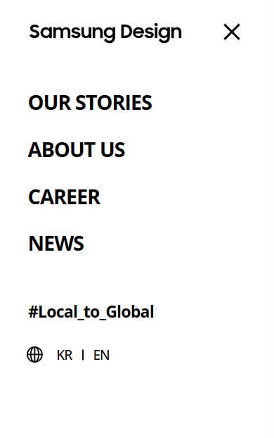
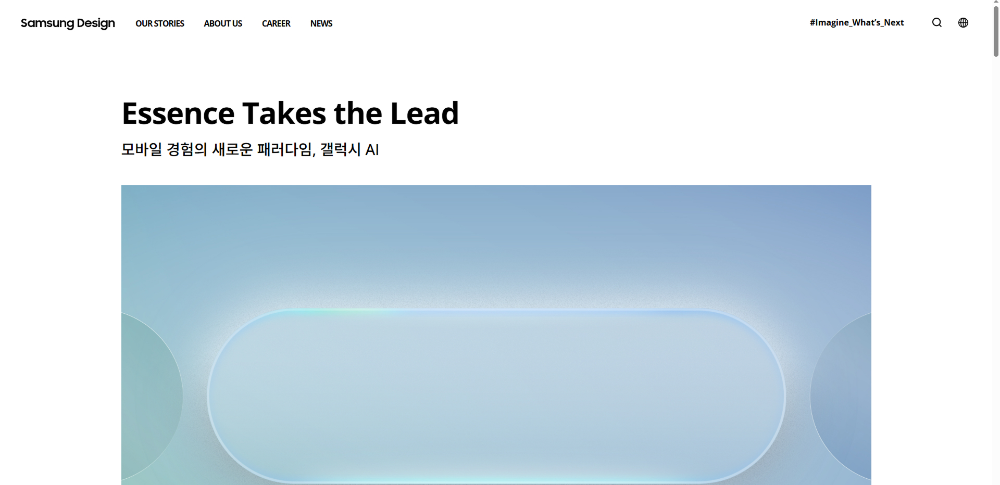
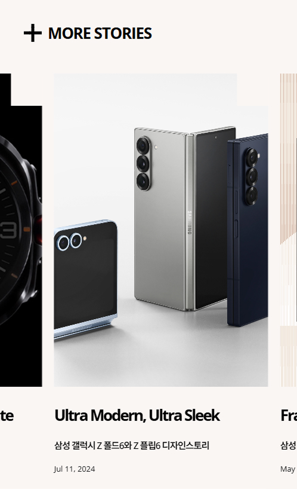
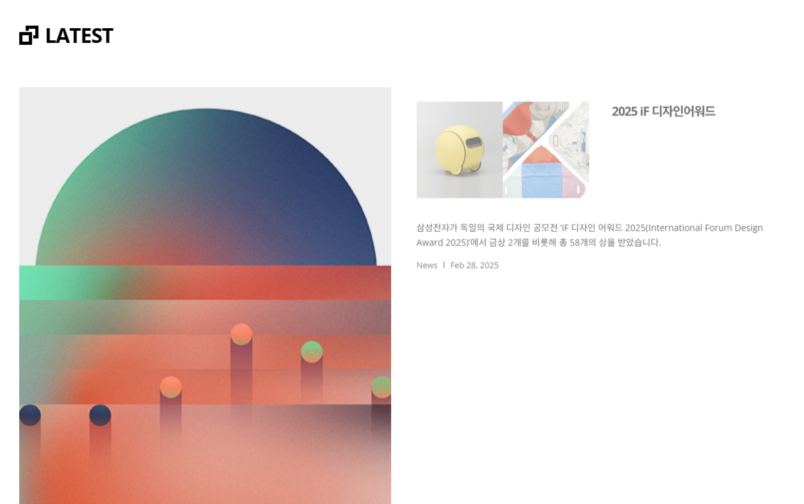
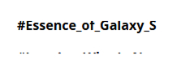
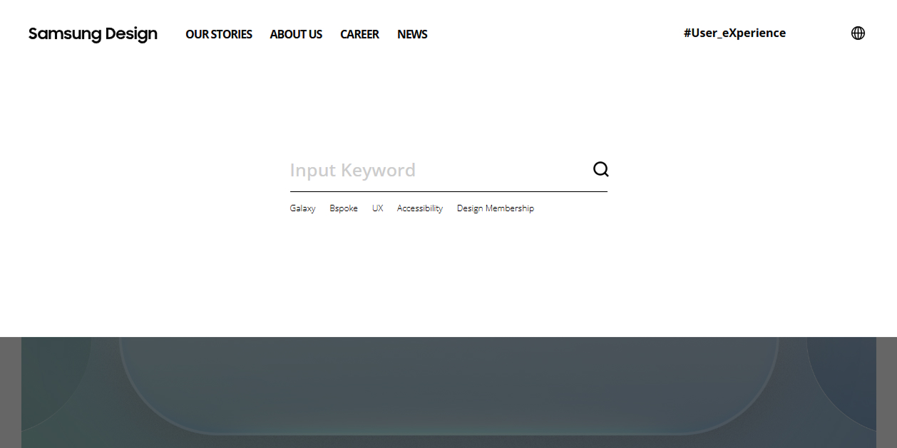
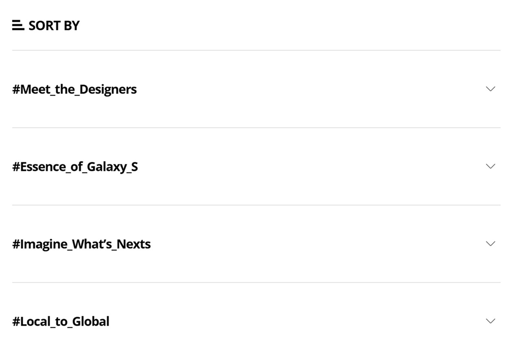
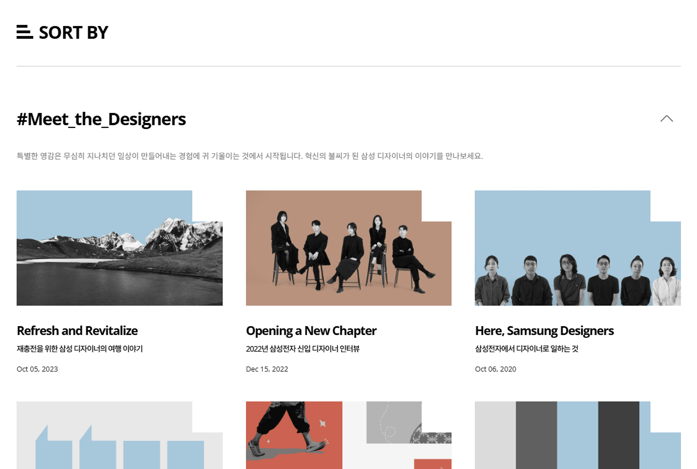
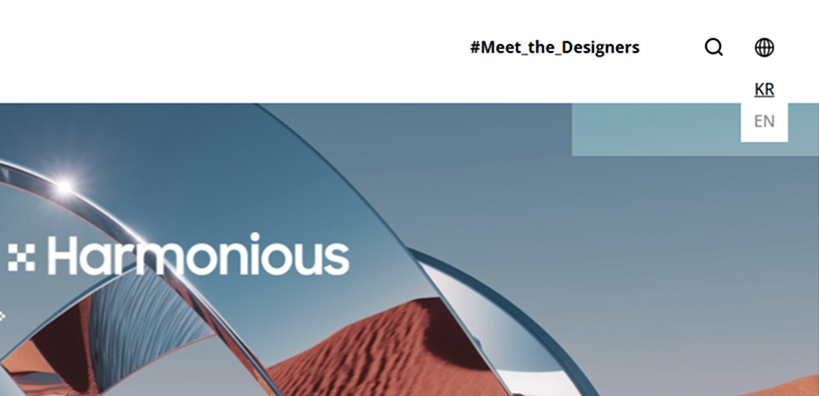

## 반응형 웹 UI CLONE 프로젝트 (DESIGN SAMSUNG)

삼성 공식 웹사이트를 참조하여 제작한 반응형 랜딩 페이지입니다. <br>
기존 CSS를 이용한 코드와는 달리 Vanilla JavaScript, Swiper, GSAP를 활용해 인터랙션으로 구현하였으며, <br>
PC와 모바일 환경 모두에서 일관된 사용자 경험(UX)을 제공할 수 있도록 설계하였습니다. <br>
디자인과 개발 간의 흐름을 고려한 UI 구성과 부드러운 애니메이션 처리에 중점을 두었습니다. <br>

<br/>

### 🎯 주요 기능

- 반응형 내비게이션 구조
- 모바일 이미지 슬라이더
- 스크롤 트리거 애니메이션
- 텍스트 롤링 슬라이더 (setInterval)
- 데스크탑 커스텀 호버 효과
- 디바이스별 이미지 및 UI 최적화
- 접힘/펼침 애니메이션 (Sort By)

<br/>

### 🛠️ 사용 기술

| 기술 | 설명 |
|------|------|
|  | HTML5 마크업 구조 |
|  | CSS3 반응형 스타일 처리 |
|  | JavaScript DOM 제어, Swiper & GSAP 연동 |
|  | Swiper.js 모바일 슬라이더 구현 |
|  | GSAP 고급 스크롤 애니메이션 |

<br/>

### 📸 데모 이미지

| 모바일 메뉴 | 메인 화면 | 모바일 슬라이드 |
|-------------|----------------|-------------|
|  |  |  |


<br/>

### ⚙️ 기능 상세 설명

### 1. 화면 크기 확인 (`checkMobile`)

- checkMobile 함수는 화면 너비가 760px 미만일 경우 모바일 화면으로 간주하고, 그에 맞게 레이아웃을 조정합니다.

```javascript
function checkMobile() {
	let newIsMobile = window.innerWidth < 760;

	if (newIsMobile !== isMobile) {
		isMobile = newIsMobile;

		if (isMobile) { //모바일 화면일 때
			header.classList.remove("active");
			dim.classList.remove("active");
			body.classList.add("scroll");

			if (research) research.classList.add("on");
			if (mo_menu) mo_menu.classList.remove("active");
			if (mo_txt_slide) mo_txt_slide.classList.add("on");
			if (mo_lang) mo_lang.classList.add("on");
		}
		else{ //데스크탑 화면일 때
			if (research) research.classList.add("on");
			if (mo_menu) mo_menu.classList.remove("active");
			if (mo_txt_slide) mo_txt_slide.classList.remove("on");
			if (mo_lang) mo_lang.classList.remove("on");
		}
	}
};

---

### ✅ 2. 디바운스 처리 (debounce)

- 화면 크기 조정 (resize) 이벤트에 디바운스를 적용하여, 화면 크기 조정이 끝난 후 한 번만 함수가 실행되도록 합니다.

```javascript
function debounce(func, delay) {
	let timeoutId;
	return function(...args) {
		clearTimeout(timeoutId);
		timeoutId = setTimeout(() => {
			func.apply(this, args);
		}, delay);
	};
}

const debouncedCheckMobile = debounce(checkMobile, 100); // checkMobile 함수에 debounce 적용

window.addEventListener("resize", debouncedCheckMobile);
```

---

### ✅  3. GSAP 애니메이션 (gsap)

- gsap.set을 사용하여 초기 상태를 설정한 뒤, scrollTrigger를 이용해 각 섹션을 스크롤할 때마다 애니메이션을 적용합니다.
- main_txt, la_left, sortBy_inner 등의 요소는 스크롤할 때 나타나도록 설정되어 있습니다.



```javascript
let main_image=document.querySelector("#main .image img");
let main_txt=[
	document.querySelector("#main .text p"),
	document.querySelectorAll("#main .text ul li")
];
let la_left=document.querySelectorAll("#latest .left");
let la_rightList=document.querySelectorAll("#latest .right > li");
let sortBy_inner=document.querySelectorAll("#sort .inner_content ul li")
let sortBy_p=document.querySelector("#sort .inner_content p");
let more_image=document.querySelectorAll("#morestories .image img");
let news=document.querySelectorAll("#news .swiper-slide img")

gsap.set(main_txt, { y: 50, opacity: 0 });
gsap.set(la_left, { opacity: 0 });
gsap.set(la_rightList, { opacity: 0 });
gsap.set(sortBy_inner, { y: 50, opacity: 0 });
gsap.set(more_image, { transition: "none", y: 300, opacity: 0 });
gsap.set(news, { transition: "none", y: 500, opacity: 0 });

pageList.forEach(function(item, i){
	const tl=gsap.timeline({
		scrollTrigger: {
			trigger: item,
			start: "top 80%",
			end: "bottom 20%",
			onEnter: function(){
				if(item.classList.contains("active") == false){
					item.classList.add("active");
				}

				if (i === 0) {
					gsap.to(main_txt, {
						y: 0,
						opacity: 1,
						duration: 1,
						overwrite: true
					});
				}

				if (i === 1) {
					tl.fromTo(la_left, { y: 50, opacity: 0 },{ y: 0, opacity: 1, duration: 0.3, overwrite: true });
					la_rightList.forEach(function(innerItem, index) {
						tl.fromTo(innerItem,
							{ y: 50, opacity: 0 },
							{
								y: 0,
								opacity: 1,
								duration: 0.3,
								stagger: 0.1,
								overwrite: true
							}
						);
					});
				}

				if (i === 3) {
					let tl_sort = gsap.timeline({ overwrite: true });
					tl_sort.to(sortBy_p, { y: 0, opacity: 1, duration: 0.3 });
					sortBy_inner.forEach(function(innerItem, innerIndex) {
						tl_sort.fromTo(innerItem,
							{ y: 50, opacity: 0 },
							{
								y: 0,
								opacity: 1,
								duration: 0.3,
								stagger: 0.01
							}
						);
					});
				}

				if (i === 4) {
					let tl_more = gsap.timeline({ overwrite: true });
					gsap.set(more_image, { transition: "none", y: 100, opacity: 0 });
					more_image.forEach(function(imgItem, imgIndex) {
						tl_more.to(imgItem, {
							y: 0,
							opacity: 1,
							duration: 0.3,
							stagger: 0.01,
							ease: "sine.out"
						});
					});

					let more_elements = document.querySelectorAll("#morestories .swiper-slide h3, #morestories .swiper-slide p, #morestories .swiper-slide span");
					tl_more.fromTo(
						more_elements,
						{ opacity: 0 },
						{ opacity: 1, duration: 0.2, stagger: 0.1 },
						"-=1"
					);
				}

				if (i === 5) {
					let tl_news = gsap.timeline({ overwrite: true });
					gsap.set(news, { transition: "none", y: 100, opacity: 0 });
					news.forEach(function(imgItem, imgIndex) {
						tl_news.to(imgItem, {
							y: 0,
							opacity: 1,
							duration: 0.3,
							stagger: 0.01,
							ease: "sine.out"
						});
					});
				}
			},
			onEnterBack: function(){
				if(item.classList.contains("active") == false){
					item.classList.add("active");
				}

				if (i === 0) {
					gsap.to(main_txt, {
						y: 0,
						opacity: 1,
						duration: 1,
						overwrite: true
					});
				}

				if (i === 1) {
					tl.fromTo(la_left, { y: 50, opacity: 0 },{ y: 0, opacity: 1, duration: 0.3, overwrite: true });
					la_rightList.forEach(function(innerItem, index) {
						tl.fromTo(innerItem,
							{ y: 50, opacity: 0 },
							{
								y: 0,
								opacity: 1,
								duration: 0.3,
								stagger: 0.1,
								overwrite: true
							}
						);
					});
				}
			}
		}
	})
});
```

---

### ✅ 4. 텍스트 슬라이더

- startTextSlider 함수는 주어진 리스트 요소에서 첫 번째 항목을 주기적으로 슬라이딩하여 애니메이션 효과를 줍니다.



```javascript
function startTextSlider(selector) {
	const slider = document.querySelector(selector);

	if (!slider) return;

	setInterval(function () {
		const firstItem = slider.querySelector("li:first-child");
		const itemHeight = firstItem.offsetHeight;

		slider.style.transition = "top 0.5s";
		slider.style.top = `-${itemHeight}px`;

		// 애니메이션 후 처리
		setTimeout(function () {
			slider.appendChild(firstItem);
			slider.style.transition = "none";
			slider.style.top = "0";
		}, 500);
	}, 3000);
}

startTextSlider(".text_slider ul");
startTextSlider(".mo_text_slider ul");
```

---

### ✅ 5. 리서치 메뉴 동작

- research 버튼을 클릭하면 헤더와 dim이 활성화되고, 모바일 메뉴가 활성화된 상황이면 비활성화합니다.
- form_close 버튼을 클릭하면 리서치 영역을 비활성화 합니다.
- dim 영역을 클릭하면 헤더와 dim이 닫히도록 설정됩니다.



```javascript
research.addEventListener("click", function(e){
	e.preventDefault();

	header.classList.add("active");
	dim.classList.add("active");
	body.classList.remove("scroll");

	if (mo_menu) mo_menu.classList.remove("active");
	if (research) research.classList.remove("on");
});

// form close
form_close.addEventListener("click", function(e){
	e.preventDefault();

	header.classList.remove("active");
	dim.classList.remove("active");
	body.classList.add("scroll");

	if (research) research.classList.add("on");
	if (mo_menu) mo_menu.classList.remove("active");
});

//dim 
dim.addEventListener("click", function(){
	if (isMobile) { //모바일 화면일 때
		header.classList.remove("active");
		dim.classList.remove("active");
		body.classList.add("scroll");

		if (research) research.classList.add("on");
		if (mo_menu) mo_menu.classList.remove("active");
	}
	else{ //데스크탑 화면일 때
		header.classList.remove("active");
		dim.classList.remove("active");
		body.classList.add("scroll");

		if (research) research.classList.add("on");
		if (mo_menu) mo_menu.classList.remove("active");
	}
});
```

---

### ✅ 6. 정렬 메뉴 (sortBy)

- sortBy_list의 각 항목을 클릭하면 해당 항목의 내용을 토글하며, 그 안의 항목들이 애니메이션과 함께 나타납니다




```javascript
//sortBy
	let sortBy_list = document.querySelectorAll(".inner_title");

	// 초기 상태 설정 (첫 번째 항목 열기 - 내용 보이도록)
	const firstTitle = sortBy_list[0];
	const firstContent = firstTitle?.nextElementSibling;

	if (firstContent) {
		firstContent.classList.add("active");

		const initialLiGroup = firstContent.querySelectorAll(".inner_content ul li");
		const initialParagraph = firstContent.querySelector("p");

		gsap.set(initialParagraph, { y: 0, opacity: 1 });
		gsap.set(initialLiGroup, { y: 0, opacity: 1, stagger: 0.1 });
		
		firstTitle?.querySelector("span")?.classList.add("active");
	}

	sortBy_list.forEach(function(title){
		title.addEventListener("click", function (e) {
				e.preventDefault();

				const span = title.querySelector("span");
				const nextElement = title.nextElementSibling;
				const liGroup = nextElement?.querySelectorAll(".inner_content ul li");
				const paragraph = nextElement?.querySelector("p");

			// 클릭한 요소 토글
			if (nextElement) {
				nextElement.classList.toggle("active");
			}
			if (span) {
				span.classList.toggle("active");
			}

			const isActive=nextElement?.classList.contains("active");

			gsap.killTweensOf(paragraph);
			liGroup.forEach(item => gsap.killTweensOf(item));

			gsap.set(paragraph, { y: 50, opacity: 0 });
			gsap.set(liGroup, { y: 50, opacity: 0 });

			ScrollTrigger.refresh();

			if (isActive) {
				nextElement.style.visibility = "hidden";

				requestAnimationFrame(() => {
					nextElement.style.visibility = "visible";

					let tl = gsap.timeline();
					tl.to(paragraph, { y: 0, opacity: 1, duration: 0.2 });
					liGroup.forEach((item, i) => {
						tl.to(item, {
							y: 0,
							opacity: 1,
							duration: 0.2,
							stagger: 0.1
						});
					});
				});
			}
		});
	});
```

---

### ✅ 7. 언어 선택 메뉴 (lang)

- 언어 선택 메뉴가 마우스를 올렸을 때 나타나고, 마우스를 떼면 사라지도록 설정됩니다.



```javascript
let langList = lang.nextElementSibling;

//lang hover
lang.addEventListener("mouseenter", function () {
	langList.classList.add("active");
});

langList.addEventListener("mouseleave", function () {
	langList.classList.remove("active");
});
```

---

### ✅ 8. 모바일 메뉴 토글

- mo_menu를 클릭하면 모바일 메뉴가 열리거나 닫히며, 그에 따라 nav 메뉴와 다른 요소들의 상태가 변경됩니다.


```javascript
// mo_menu
mo_menu.addEventListener("click", function(e){
	e.preventDefault();

	if(mo_menu.classList.contains("active")){
		mo_menu.classList.remove("active");
		nav.classList.remove("active");
		body.classList.add("scroll");

		if (research) research.classList.add("on");
	}
	else{
		mo_menu.classList.add("active");
		nav.classList.add("active");
		body.classList.remove("scroll");

		if (research) research.classList.remove("on");
	}
});
```

---

### ✅ 9. 모바일 슬라이드 정렬 (swiper)


```javascript
//swiper
let moreSwiperInstance = null;
let newsSwiperInstance = null;

function initMoreSwiper() {
	const container = document.querySelector('.moreSwiper');
	const wrapper = container?.querySelector('.swiper-wrapper');

	if (window.innerWidth < 760 && !moreSwiperInstance) {
		moreSwiperInstance = new Swiper(container, {
			slidesPerView: 1.25,
			spaceBetween: 0,
		});
	} else if (window.innerWidth >= 760 && moreSwiperInstance) {
		moreSwiperInstance.destroy(true, true);
		moreSwiperInstance = null;
		if (wrapper) wrapper.removeAttribute('style');
	}
}

function initNewsSwiper() {
	const container = document.querySelector('.newsSwiper');
	const wrapper = container?.querySelector('.swiper-wrapper');

	if (window.innerWidth < 760 && !newsSwiperInstance) {
		newsSwiperInstance = new Swiper(container, {
			slidesPerView: 1.25,
			spaceBetween: 0,
		});
	} else if (window.innerWidth >= 760 && newsSwiperInstance) {
		newsSwiperInstance.destroy(true, true);
		newsSwiperInstance = null;
		if (wrapper) wrapper.removeAttribute('style');
	}
}

function initSwipers() {
	initMoreSwiper();
	initNewsSwiper();
}

initSwipers();
window.addEventListener('resize', initSwipers);
```
